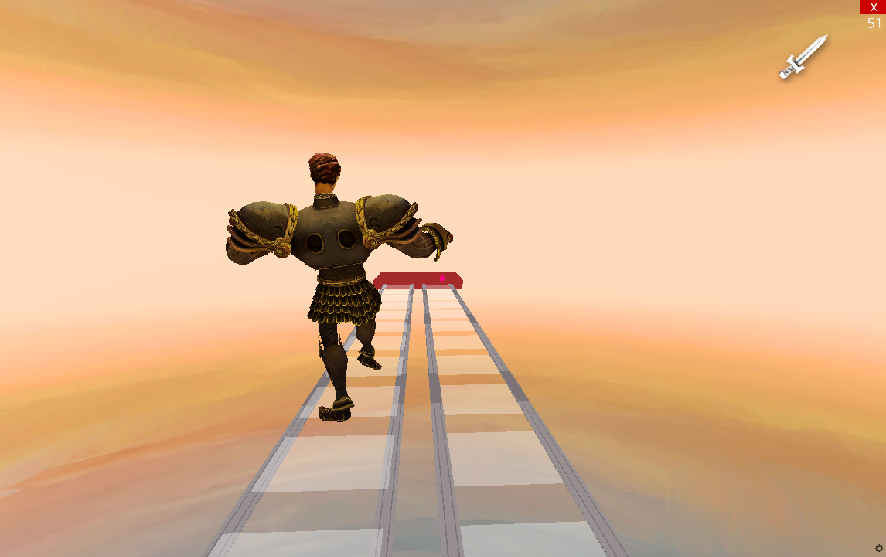
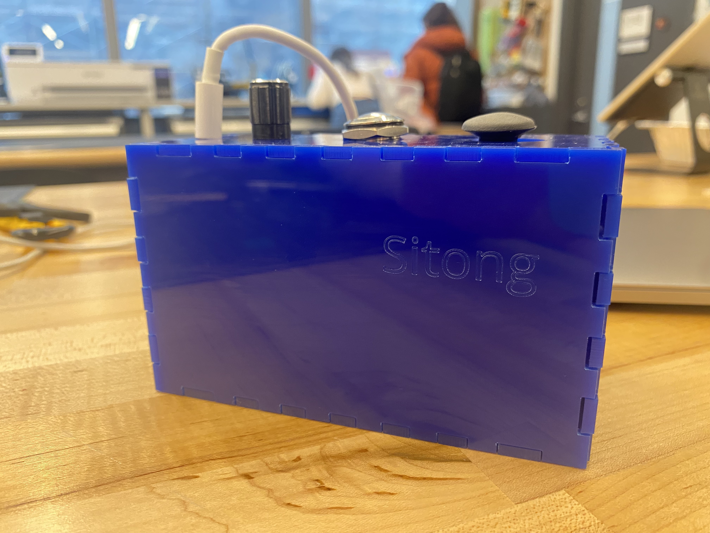

# ZenoReality


[](https://github.com/sitongfX/ZenoReality/actions/workflows/main.yml)
[](https://codecov.io/gh/sitongfX/ZenoReality)


## What is it
The project uses a interactive controller to journey into a philosophical game with absolute freedom. See detailed [ducumentation](https://zenoreality.readthedocs.io/en/stable/) page for hardware building and playing instructions. The game uses [ursina](https://www.ursinaengine.org/), an open source game engine and Python.

A prettier read-me is [here](https://sitongfx.github.io/ZenoReality/) too.


## Demo Picture
Game Scene: 
**click image to see a demo trailler**
[](https://youtu.be/ThDYJI4Rjx4)
click image to see a demo trailler

Controller:


## API Guide

Sample auto-generated api documentation:


more api pages under folder [/autogen_api](https://github.com/sitongfX/ZenoReality/tree/main/autogen_api)


Prerequite:
1. Make sure ursina engine is downloaded.
2. Have Python 3.6 or newer.

Use the following command to run the program under the project path:

``` bash
# install ursina in terminal
pip install ursina
```

Then run the game with the appropriate version

``` bash
python keyboard_game.py     # if you are playing with keyboard
```
or

``` bash
python controller_game.py # if you are playing with a controller
```
make sure to check out the hardware guide in the detailed documentation mentioned above.

